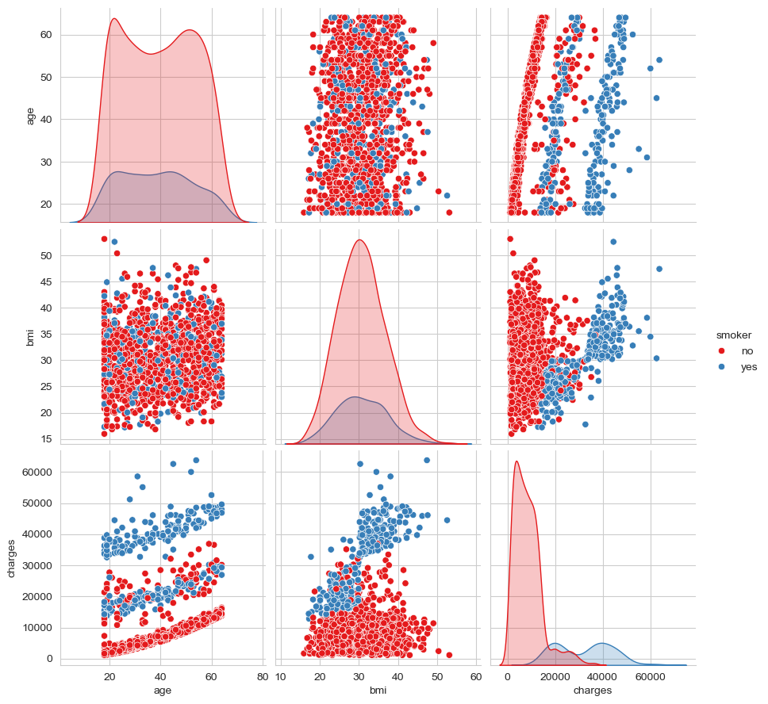
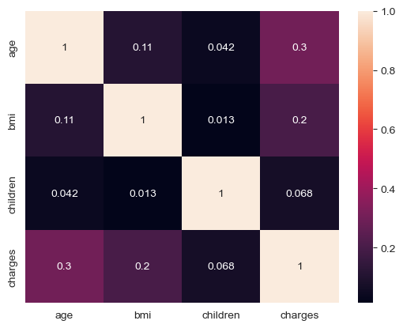

```python
import pandas as pd
```


```python
data = pd.read_csv("insurance.csv")
```


```python
data.head()
```


<div>
<style scoped>
    .dataframe tbody tr th:only-of-type {
        vertical-align: middle;
    }

    .dataframe tbody tr th {
        vertical-align: top;
    }

    .dataframe thead th {
        text-align: right;
    }
</style>
<table border="1" class="dataframe">
  <thead>
    <tr style="text-align: right;">
      <th></th>
      <th>age</th>
      <th>sex</th>
      <th>bmi</th>
      <th>children</th>
      <th>smoker</th>
      <th>region</th>
      <th>charges</th>
    </tr>
  </thead>
  <tbody>
    <tr>
      <th>0</th>
      <td>19</td>
      <td>female</td>
      <td>27.900</td>
      <td>0</td>
      <td>yes</td>
      <td>southwest</td>
      <td>16884.92400</td>
    </tr>
    <tr>
      <th>1</th>
      <td>18</td>
      <td>male</td>
      <td>33.770</td>
      <td>1</td>
      <td>no</td>
      <td>southeast</td>
      <td>1725.55230</td>
    </tr>
    <tr>
      <th>2</th>
      <td>28</td>
      <td>male</td>
      <td>33.000</td>
      <td>3</td>
      <td>no</td>
      <td>southeast</td>
      <td>4449.46200</td>
    </tr>
    <tr>
      <th>3</th>
      <td>33</td>
      <td>male</td>
      <td>22.705</td>
      <td>0</td>
      <td>no</td>
      <td>northwest</td>
      <td>21984.47061</td>
    </tr>
    <tr>
      <th>4</th>
      <td>32</td>
      <td>male</td>
      <td>28.880</td>
      <td>0</td>
      <td>no</td>
      <td>northwest</td>
      <td>3866.85520</td>
    </tr>
  </tbody>
</table>
</div>


```python
len(data)
```


    1338


#### Understanding the dataset


```python
# How big the dataset is?

data.shape 

#1338 rows and 7 columns
```


    (1338, 7)


```python
# Ensure the data is clean and doesn't have any missing parts

data.info()
```

    <class 'pandas.core.frame.DataFrame'>
    RangeIndex: 1338 entries, 0 to 1337
    Data columns (total 7 columns):
     #   Column    Non-Null Count  Dtype  
    ---  ------    --------------  -----  
     0   age       1338 non-null   int64  
     1   sex       1338 non-null   object 
     2   bmi       1338 non-null   float64
     3   children  1338 non-null   int64  
     4   smoker    1338 non-null   object 
     5   region    1338 non-null   object 
     6   charges   1338 non-null   float64
    dtypes: float64(2), int64(2), object(3)
    memory usage: 73.3+ KB


```python
# To find missing data 

data.isnull()
```


<div>
<style scoped>
    .dataframe tbody tr th:only-of-type {
        vertical-align: middle;
    }

    .dataframe tbody tr th {
        vertical-align: top;
    }

    .dataframe thead th {
        text-align: right;
    }
</style>
<table border="1" class="dataframe">
  <thead>
    <tr style="text-align: right;">
      <th></th>
      <th>age</th>
      <th>sex</th>
      <th>bmi</th>
      <th>children</th>
      <th>smoker</th>
      <th>region</th>
      <th>charges</th>
    </tr>
  </thead>
  <tbody>
    <tr>
      <th>0</th>
      <td>False</td>
      <td>False</td>
      <td>False</td>
      <td>False</td>
      <td>False</td>
      <td>False</td>
      <td>False</td>
    </tr>
    <tr>
      <th>1</th>
      <td>False</td>
      <td>False</td>
      <td>False</td>
      <td>False</td>
      <td>False</td>
      <td>False</td>
      <td>False</td>
    </tr>
    <tr>
      <th>2</th>
      <td>False</td>
      <td>False</td>
      <td>False</td>
      <td>False</td>
      <td>False</td>
      <td>False</td>
      <td>False</td>
    </tr>
    <tr>
      <th>3</th>
      <td>False</td>
      <td>False</td>
      <td>False</td>
      <td>False</td>
      <td>False</td>
      <td>False</td>
      <td>False</td>
    </tr>
    <tr>
      <th>4</th>
      <td>False</td>
      <td>False</td>
      <td>False</td>
      <td>False</td>
      <td>False</td>
      <td>False</td>
      <td>False</td>
    </tr>
    <tr>
      <th>...</th>
      <td>...</td>
      <td>...</td>
      <td>...</td>
      <td>...</td>
      <td>...</td>
      <td>...</td>
      <td>...</td>
    </tr>
    <tr>
      <th>1333</th>
      <td>False</td>
      <td>False</td>
      <td>False</td>
      <td>False</td>
      <td>False</td>
      <td>False</td>
      <td>False</td>
    </tr>
    <tr>
      <th>1334</th>
      <td>False</td>
      <td>False</td>
      <td>False</td>
      <td>False</td>
      <td>False</td>
      <td>False</td>
      <td>False</td>
    </tr>
    <tr>
      <th>1335</th>
      <td>False</td>
      <td>False</td>
      <td>False</td>
      <td>False</td>
      <td>False</td>
      <td>False</td>
      <td>False</td>
    </tr>
    <tr>
      <th>1336</th>
      <td>False</td>
      <td>False</td>
      <td>False</td>
      <td>False</td>
      <td>False</td>
      <td>False</td>
      <td>False</td>
    </tr>
    <tr>
      <th>1337</th>
      <td>False</td>
      <td>False</td>
      <td>False</td>
      <td>False</td>
      <td>False</td>
      <td>False</td>
      <td>False</td>
    </tr>
  </tbody>
</table>
<p>1338 rows × 7 columns</p>
</div>


```python
# Count the number of missing entries to quickly analyze 

data.isnull().sum()
```


    age         0
    sex         0
    bmi         0
    children    0
    smoker      0
    region      0
    charges     0
    dtype: int64


```python
# Check the character type 

data.dtypes
```


    age           int64
    sex          object
    bmi         float64
    children      int64
    smoker       object
    region       object
    charges     float64
    dtype: object


#### Data Preprocessing


```python
# Convert certain data into datatype: category

data["sex"] = data["sex"].astype("category")
data["smoker"] = data["smoker"].astype("category")
data["region"] = data["region"].astype("category")

data.dtypes
```


    age            int64
    sex         category
    bmi          float64
    children       int64
    smoker      category
    region      category
    charges      float64
    dtype: object


```python
# Understand the numeric data better

# Use .describe() to get the mean, average of the values 

data.describe().T 

# Transposing it = .T
```


<div>
<style scoped>
    .dataframe tbody tr th:only-of-type {
        vertical-align: middle;
    }

    .dataframe tbody tr th {
        vertical-align: top;
    }

    .dataframe thead th {
        text-align: right;
    }
</style>
<table border="1" class="dataframe">
  <thead>
    <tr style="text-align: right;">
      <th></th>
      <th>count</th>
      <th>mean</th>
      <th>std</th>
      <th>min</th>
      <th>25%</th>
      <th>50%</th>
      <th>75%</th>
      <th>max</th>
    </tr>
  </thead>
  <tbody>
    <tr>
      <th>age</th>
      <td>1338.0</td>
      <td>39.207025</td>
      <td>14.049960</td>
      <td>18.0000</td>
      <td>27.00000</td>
      <td>39.000</td>
      <td>51.000000</td>
      <td>64.00000</td>
    </tr>
    <tr>
      <th>bmi</th>
      <td>1338.0</td>
      <td>30.663397</td>
      <td>6.098187</td>
      <td>15.9600</td>
      <td>26.29625</td>
      <td>30.400</td>
      <td>34.693750</td>
      <td>53.13000</td>
    </tr>
    <tr>
      <th>children</th>
      <td>1338.0</td>
      <td>1.094918</td>
      <td>1.205493</td>
      <td>0.0000</td>
      <td>0.00000</td>
      <td>1.000</td>
      <td>2.000000</td>
      <td>5.00000</td>
    </tr>
    <tr>
      <th>charges</th>
      <td>1338.0</td>
      <td>13270.422265</td>
      <td>12110.011237</td>
      <td>1121.8739</td>
      <td>4740.28715</td>
      <td>9382.033</td>
      <td>16639.912515</td>
      <td>63770.42801</td>
    </tr>
  </tbody>
</table>
</div>


```python
# To get smokers' data, use .groupby("smoker") and find its mean

 # smoke_data = data.groupby("smoker").mean().round(2)

# Error occurs as the dtype of smoker is category
```


```python
# Group by "smoker" and calculate mean for numeric columns only
smoke_data = data.groupby("smoker").mean(numeric_only=True).round(2)
smoke_data
```

    /var/folders/ms/7vn4x78d5059xmtflsbk8b6m0000gn/T/ipykernel_1373/1388409192.py:2: FutureWarning: The default of observed=False is deprecated and will be changed to True in a future version of pandas. Pass observed=False to retain current behavior or observed=True to adopt the future default and silence this warning.
      smoke_data = data.groupby("smoker").mean(numeric_only=True).round(2)


<div>
<style scoped>
    .dataframe tbody tr th:only-of-type {
        vertical-align: middle;
    }

    .dataframe tbody tr th {
        vertical-align: top;
    }

    .dataframe thead th {
        text-align: right;
    }
</style>
<table border="1" class="dataframe">
  <thead>
    <tr style="text-align: right;">
      <th></th>
      <th>age</th>
      <th>bmi</th>
      <th>children</th>
      <th>charges</th>
    </tr>
    <tr>
      <th>smoker</th>
      <th></th>
      <th></th>
      <th></th>
      <th></th>
    </tr>
  </thead>
  <tbody>
    <tr>
      <th>no</th>
      <td>39.39</td>
      <td>30.65</td>
      <td>1.09</td>
      <td>8434.27</td>
    </tr>
    <tr>
      <th>yes</th>
      <td>38.51</td>
      <td>30.71</td>
      <td>1.11</td>
      <td>32050.23</td>
    </tr>
  </tbody>
</table>
</div>


#### Data visualization


```python
import seaborn as sns
sns.set_style("whitegrid")
sns.pairplot(data[["age", "bmi", "charges", "smoker"]], 
             hue = "smoker", 
             height = 3, 
             palette = "Set1")
```


    <seaborn.axisgrid.PairGrid at 0x13d14e4e0>


    

    


```python
# Find the co-relation between variables - important step in ML

sns.heatmap(data.corr(), annot=True)
```


    ---------------------------------------------------------------------------

    ValueError                                Traceback (most recent call last)

    Cell In[39], line 3
          1 # Find the co-relation between variables - important step in ML
    ----> 3 sns.heatmap(data.corr(), annot=True)


    File /opt/anaconda3/lib/python3.12/site-packages/pandas/core/frame.py:11049, in DataFrame.corr(self, method, min_periods, numeric_only)
      11047 cols = data.columns
      11048 idx = cols.copy()
    > 11049 mat = data.to_numpy(dtype=float, na_value=np.nan, copy=False)
      11051 if method == "pearson":
      11052     correl = libalgos.nancorr(mat, minp=min_periods)


    File /opt/anaconda3/lib/python3.12/site-packages/pandas/core/frame.py:1993, in DataFrame.to_numpy(self, dtype, copy, na_value)
       1991 if dtype is not None:
       1992     dtype = np.dtype(dtype)
    -> 1993 result = self._mgr.as_array(dtype=dtype, copy=copy, na_value=na_value)
       1994 if result.dtype is not dtype:
       1995     result = np.asarray(result, dtype=dtype)


    File /opt/anaconda3/lib/python3.12/site-packages/pandas/core/internals/managers.py:1694, in BlockManager.as_array(self, dtype, copy, na_value)
       1692         arr.flags.writeable = False
       1693 else:
    -> 1694     arr = self._interleave(dtype=dtype, na_value=na_value)
       1695     # The underlying data was copied within _interleave, so no need
       1696     # to further copy if copy=True or setting na_value
       1698 if na_value is lib.no_default:


    File /opt/anaconda3/lib/python3.12/site-packages/pandas/core/internals/managers.py:1747, in BlockManager._interleave(self, dtype, na_value)
       1741 rl = blk.mgr_locs
       1742 if blk.is_extension:
       1743     # Avoid implicit conversion of extension blocks to object
       1744 
       1745     # error: Item "ndarray" of "Union[ndarray, ExtensionArray]" has no
       1746     # attribute "to_numpy"
    -> 1747     arr = blk.values.to_numpy(  # type: ignore[union-attr]
       1748         dtype=dtype,
       1749         na_value=na_value,
       1750     )
       1751 else:
       1752     arr = blk.get_values(dtype)


    File /opt/anaconda3/lib/python3.12/site-packages/pandas/core/arrays/base.py:568, in ExtensionArray.to_numpy(self, dtype, copy, na_value)
        539 def to_numpy(
        540     self,
        541     dtype: npt.DTypeLike | None = None,
        542     copy: bool = False,
        543     na_value: object = lib.no_default,
        544 ) -> np.ndarray:
        545     """
        546     Convert to a NumPy ndarray.
        547 
       (...)
        566     numpy.ndarray
        567     """
    --> 568     result = np.asarray(self, dtype=dtype)
        569     if copy or na_value is not lib.no_default:
        570         result = result.copy()


    File /opt/anaconda3/lib/python3.12/site-packages/pandas/core/arrays/_mixins.py:81, in ravel_compat.<locals>.method(self, *args, **kwargs)
         78 @wraps(meth)
         79 def method(self, *args, **kwargs):
         80     if self.ndim == 1:
    ---> 81         return meth(self, *args, **kwargs)
         83     flags = self._ndarray.flags
         84     flat = self.ravel("K")


    File /opt/anaconda3/lib/python3.12/site-packages/pandas/core/arrays/categorical.py:1664, in Categorical.__array__(self, dtype, copy)
       1662 ret = take_nd(self.categories._values, self._codes)
       1663 if dtype and np.dtype(dtype) != self.categories.dtype:
    -> 1664     return np.asarray(ret, dtype)
       1665 # When we're a Categorical[ExtensionArray], like Interval,
       1666 # we need to ensure __array__ gets all the way to an
       1667 # ndarray.
       1668 return np.asarray(ret)


    ValueError: could not convert string to float: 'southwest'


```python
# We can only use numerical data to find the co-relation matrix

numeric_data = data.select_dtypes(include=["number"])

sns.heatmap(numeric_data.corr(), annot=True)
```


    <Axes: >


    

    


### Our data is all set and ready to building a model

#### Building a regression model


```python
# We are predicting a number - predict charges - Target variable
```


```python
data.columns
```


    Index(['age', 'sex', 'bmi', 'children', 'smoker', 'region', 'charges'], dtype='object')


```python
data=pd.get_dummies(data)
```


```python
data.columns
```


    Index(['age', 'bmi', 'children', 'charges', 'sex_female', 'sex_male',
           'smoker_no', 'smoker_yes', 'region_northeast', 'region_northwest',
           'region_southeast', 'region_southwest'],
          dtype='object')


```python
# We are going to predict the charges. So it is the target variable
```


```python
y=data["charges"]
```


```python
# Remember, our model has two parts - A target variable and Features

# To ensure our model is doing really good, we have to test the model in the data that it has never seen before
```


```python
X = data.drop("charges", axis=1)
```


```python
from sklearn.model_selection import train_test_split
```


```python
X_train, X_test, y_train, y_test = train_test_split(X, y, train_size=0.80, random_state=1)
```


```python
# Now we are building the model
```


```python
from sklearn.linear_model import LinearRegression
```


```python
lr=LinearRegression()
```


```python
# Now our model is ready to go
```


```python
lr.fit(X_train, y_train)
```


<style>#sk-container-id-1 {
  /* Definition of color scheme common for light and dark mode */
  --sklearn-color-text: black;
  --sklearn-color-line: gray;
  /* Definition of color scheme for unfitted estimators */
  --sklearn-color-unfitted-level-0: #fff5e6;
  --sklearn-color-unfitted-level-1: #f6e4d2;
  --sklearn-color-unfitted-level-2: #ffe0b3;
  --sklearn-color-unfitted-level-3: chocolate;
  /* Definition of color scheme for fitted estimators */
  --sklearn-color-fitted-level-0: #f0f8ff;
  --sklearn-color-fitted-level-1: #d4ebff;
  --sklearn-color-fitted-level-2: #b3dbfd;
  --sklearn-color-fitted-level-3: cornflowerblue;

  /* Specific color for light theme */
  --sklearn-color-text-on-default-background: var(--sg-text-color, var(--theme-code-foreground, var(--jp-content-font-color1, black)));
  --sklearn-color-background: var(--sg-background-color, var(--theme-background, var(--jp-layout-color0, white)));
  --sklearn-color-border-box: var(--sg-text-color, var(--theme-code-foreground, var(--jp-content-font-color1, black)));
  --sklearn-color-icon: #696969;

  @media (prefers-color-scheme: dark) {
    /* Redefinition of color scheme for dark theme */
    --sklearn-color-text-on-default-background: var(--sg-text-color, var(--theme-code-foreground, var(--jp-content-font-color1, white)));
    --sklearn-color-background: var(--sg-background-color, var(--theme-background, var(--jp-layout-color0, #111)));
    --sklearn-color-border-box: var(--sg-text-color, var(--theme-code-foreground, var(--jp-content-font-color1, white)));
    --sklearn-color-icon: #878787;
  }
}

#sk-container-id-1 {
  color: var(--sklearn-color-text);
}

#sk-container-id-1 pre {
  padding: 0;
}

#sk-container-id-1 input.sk-hidden--visually {
  border: 0;
  clip: rect(1px 1px 1px 1px);
  clip: rect(1px, 1px, 1px, 1px);
  height: 1px;
  margin: -1px;
  overflow: hidden;
  padding: 0;
  position: absolute;
  width: 1px;
}

#sk-container-id-1 div.sk-dashed-wrapped {
  border: 1px dashed var(--sklearn-color-line);
  margin: 0 0.4em 0.5em 0.4em;
  box-sizing: border-box;
  padding-bottom: 0.4em;
  background-color: var(--sklearn-color-background);
}

#sk-container-id-1 div.sk-container {
  /* jupyter's `normalize.less` sets `[hidden] { display: none; }`
     but bootstrap.min.css set `[hidden] { display: none !important; }`
     so we also need the `!important` here to be able to override the
     default hidden behavior on the sphinx rendered scikit-learn.org.
     See: https://github.com/scikit-learn/scikit-learn/issues/21755 */
  display: inline-block !important;
  position: relative;
}

#sk-container-id-1 div.sk-text-repr-fallback {
  display: none;
}

div.sk-parallel-item,
div.sk-serial,
div.sk-item {
  /* draw centered vertical line to link estimators */
  background-image: linear-gradient(var(--sklearn-color-text-on-default-background), var(--sklearn-color-text-on-default-background));
  background-size: 2px 100%;
  background-repeat: no-repeat;
  background-position: center center;
}

/* Parallel-specific style estimator block */

#sk-container-id-1 div.sk-parallel-item::after {
  content: "";
  width: 100%;
  border-bottom: 2px solid var(--sklearn-color-text-on-default-background);
  flex-grow: 1;
}

#sk-container-id-1 div.sk-parallel {
  display: flex;
  align-items: stretch;
  justify-content: center;
  background-color: var(--sklearn-color-background);
  position: relative;
}

#sk-container-id-1 div.sk-parallel-item {
  display: flex;
  flex-direction: column;
}

#sk-container-id-1 div.sk-parallel-item:first-child::after {
  align-self: flex-end;
  width: 50%;
}

#sk-container-id-1 div.sk-parallel-item:last-child::after {
  align-self: flex-start;
  width: 50%;
}

#sk-container-id-1 div.sk-parallel-item:only-child::after {
  width: 0;
}

/* Serial-specific style estimator block */

#sk-container-id-1 div.sk-serial {
  display: flex;
  flex-direction: column;
  align-items: center;
  background-color: var(--sklearn-color-background);
  padding-right: 1em;
  padding-left: 1em;
}


/* Toggleable style: style used for estimator/Pipeline/ColumnTransformer box that is
clickable and can be expanded/collapsed.
- Pipeline and ColumnTransformer use this feature and define the default style
- Estimators will overwrite some part of the style using the `sk-estimator` class
*/

/* Pipeline and ColumnTransformer style (default) */

#sk-container-id-1 div.sk-toggleable {
  /* Default theme specific background. It is overwritten whether we have a
  specific estimator or a Pipeline/ColumnTransformer */
  background-color: var(--sklearn-color-background);
}

/* Toggleable label */
#sk-container-id-1 label.sk-toggleable__label {
  cursor: pointer;
  display: block;
  width: 100%;
  margin-bottom: 0;
  padding: 0.5em;
  box-sizing: border-box;
  text-align: center;
}

#sk-container-id-1 label.sk-toggleable__label-arrow:before {
  /* Arrow on the left of the label */
  content: "▸";
  float: left;
  margin-right: 0.25em;
  color: var(--sklearn-color-icon);
}

#sk-container-id-1 label.sk-toggleable__label-arrow:hover:before {
  color: var(--sklearn-color-text);
}

/* Toggleable content - dropdown */

#sk-container-id-1 div.sk-toggleable__content {
  max-height: 0;
  max-width: 0;
  overflow: hidden;
  text-align: left;
  /* unfitted */
  background-color: var(--sklearn-color-unfitted-level-0);
}

#sk-container-id-1 div.sk-toggleable__content.fitted {
  /* fitted */
  background-color: var(--sklearn-color-fitted-level-0);
}

#sk-container-id-1 div.sk-toggleable__content pre {
  margin: 0.2em;
  border-radius: 0.25em;
  color: var(--sklearn-color-text);
  /* unfitted */
  background-color: var(--sklearn-color-unfitted-level-0);
}

#sk-container-id-1 div.sk-toggleable__content.fitted pre {
  /* unfitted */
  background-color: var(--sklearn-color-fitted-level-0);
}

#sk-container-id-1 input.sk-toggleable__control:checked~div.sk-toggleable__content {
  /* Expand drop-down */
  max-height: 200px;
  max-width: 100%;
  overflow: auto;
}

#sk-container-id-1 input.sk-toggleable__control:checked~label.sk-toggleable__label-arrow:before {
  content: "▾";
}

/* Pipeline/ColumnTransformer-specific style */

#sk-container-id-1 div.sk-label input.sk-toggleable__control:checked~label.sk-toggleable__label {
  color: var(--sklearn-color-text);
  background-color: var(--sklearn-color-unfitted-level-2);
}

#sk-container-id-1 div.sk-label.fitted input.sk-toggleable__control:checked~label.sk-toggleable__label {
  background-color: var(--sklearn-color-fitted-level-2);
}

/* Estimator-specific style */

/* Colorize estimator box */
#sk-container-id-1 div.sk-estimator input.sk-toggleable__control:checked~label.sk-toggleable__label {
  /* unfitted */
  background-color: var(--sklearn-color-unfitted-level-2);
}

#sk-container-id-1 div.sk-estimator.fitted input.sk-toggleable__control:checked~label.sk-toggleable__label {
  /* fitted */
  background-color: var(--sklearn-color-fitted-level-2);
}

#sk-container-id-1 div.sk-label label.sk-toggleable__label,
#sk-container-id-1 div.sk-label label {
  /* The background is the default theme color */
  color: var(--sklearn-color-text-on-default-background);
}

/* On hover, darken the color of the background */
#sk-container-id-1 div.sk-label:hover label.sk-toggleable__label {
  color: var(--sklearn-color-text);
  background-color: var(--sklearn-color-unfitted-level-2);
}

/* Label box, darken color on hover, fitted */
#sk-container-id-1 div.sk-label.fitted:hover label.sk-toggleable__label.fitted {
  color: var(--sklearn-color-text);
  background-color: var(--sklearn-color-fitted-level-2);
}

/* Estimator label */

#sk-container-id-1 div.sk-label label {
  font-family: monospace;
  font-weight: bold;
  display: inline-block;
  line-height: 1.2em;
}

#sk-container-id-1 div.sk-label-container {
  text-align: center;
}

/* Estimator-specific */
#sk-container-id-1 div.sk-estimator {
  font-family: monospace;
  border: 1px dotted var(--sklearn-color-border-box);
  border-radius: 0.25em;
  box-sizing: border-box;
  margin-bottom: 0.5em;
  /* unfitted */
  background-color: var(--sklearn-color-unfitted-level-0);
}

#sk-container-id-1 div.sk-estimator.fitted {
  /* fitted */
  background-color: var(--sklearn-color-fitted-level-0);
}

/* on hover */
#sk-container-id-1 div.sk-estimator:hover {
  /* unfitted */
  background-color: var(--sklearn-color-unfitted-level-2);
}

#sk-container-id-1 div.sk-estimator.fitted:hover {
  /* fitted */
  background-color: var(--sklearn-color-fitted-level-2);
}

/* Specification for estimator info (e.g. "i" and "?") */

/* Common style for "i" and "?" */

.sk-estimator-doc-link,
a:link.sk-estimator-doc-link,
a:visited.sk-estimator-doc-link {
  float: right;
  font-size: smaller;
  line-height: 1em;
  font-family: monospace;
  background-color: var(--sklearn-color-background);
  border-radius: 1em;
  height: 1em;
  width: 1em;
  text-decoration: none !important;
  margin-left: 1ex;
  /* unfitted */
  border: var(--sklearn-color-unfitted-level-1) 1pt solid;
  color: var(--sklearn-color-unfitted-level-1);
}

.sk-estimator-doc-link.fitted,
a:link.sk-estimator-doc-link.fitted,
a:visited.sk-estimator-doc-link.fitted {
  /* fitted */
  border: var(--sklearn-color-fitted-level-1) 1pt solid;
  color: var(--sklearn-color-fitted-level-1);
}

/* On hover */
div.sk-estimator:hover .sk-estimator-doc-link:hover,
.sk-estimator-doc-link:hover,
div.sk-label-container:hover .sk-estimator-doc-link:hover,
.sk-estimator-doc-link:hover {
  /* unfitted */
  background-color: var(--sklearn-color-unfitted-level-3);
  color: var(--sklearn-color-background);
  text-decoration: none;
}

div.sk-estimator.fitted:hover .sk-estimator-doc-link.fitted:hover,
.sk-estimator-doc-link.fitted:hover,
div.sk-label-container:hover .sk-estimator-doc-link.fitted:hover,
.sk-estimator-doc-link.fitted:hover {
  /* fitted */
  background-color: var(--sklearn-color-fitted-level-3);
  color: var(--sklearn-color-background);
  text-decoration: none;
}

/* Span, style for the box shown on hovering the info icon */
.sk-estimator-doc-link span {
  display: none;
  z-index: 9999;
  position: relative;
  font-weight: normal;
  right: .2ex;
  padding: .5ex;
  margin: .5ex;
  width: min-content;
  min-width: 20ex;
  max-width: 50ex;
  color: var(--sklearn-color-text);
  box-shadow: 2pt 2pt 4pt #999;
  /* unfitted */
  background: var(--sklearn-color-unfitted-level-0);
  border: .5pt solid var(--sklearn-color-unfitted-level-3);
}

.sk-estimator-doc-link.fitted span {
  /* fitted */
  background: var(--sklearn-color-fitted-level-0);
  border: var(--sklearn-color-fitted-level-3);
}

.sk-estimator-doc-link:hover span {
  display: block;
}

/* "?"-specific style due to the `<a>` HTML tag */

#sk-container-id-1 a.estimator_doc_link {
  float: right;
  font-size: 1rem;
  line-height: 1em;
  font-family: monospace;
  background-color: var(--sklearn-color-background);
  border-radius: 1rem;
  height: 1rem;
  width: 1rem;
  text-decoration: none;
  /* unfitted */
  color: var(--sklearn-color-unfitted-level-1);
  border: var(--sklearn-color-unfitted-level-1) 1pt solid;
}

#sk-container-id-1 a.estimator_doc_link.fitted {
  /* fitted */
  border: var(--sklearn-color-fitted-level-1) 1pt solid;
  color: var(--sklearn-color-fitted-level-1);
}

/* On hover */
#sk-container-id-1 a.estimator_doc_link:hover {
  /* unfitted */
  background-color: var(--sklearn-color-unfitted-level-3);
  color: var(--sklearn-color-background);
  text-decoration: none;
}

#sk-container-id-1 a.estimator_doc_link.fitted:hover {
  /* fitted */
  background-color: var(--sklearn-color-fitted-level-3);
}
</style><div id="sk-container-id-1" class="sk-top-container"><div class="sk-text-repr-fallback"><pre>LinearRegression()</pre><b>In a Jupyter environment, please rerun this cell to show the HTML representation or trust the notebook. <br />On GitHub, the HTML representation is unable to render, please try loading this page with nbviewer.org.</b></div><div class="sk-container" hidden><div class="sk-item"><div class="sk-estimator fitted sk-toggleable"><input class="sk-toggleable__control sk-hidden--visually" id="sk-estimator-id-1" type="checkbox" checked><label for="sk-estimator-id-1" class="sk-toggleable__label fitted sk-toggleable__label-arrow fitted">&nbsp;&nbsp;LinearRegression<a class="sk-estimator-doc-link fitted" rel="noreferrer" target="_blank" href="https://scikit-learn.org/1.4/modules/generated/sklearn.linear_model.LinearRegression.html">?<span>Documentation for LinearRegression</span></a><span class="sk-estimator-doc-link fitted">i<span>Fitted</span></span></label><div class="sk-toggleable__content fitted"><pre>LinearRegression()</pre></div> </div></div></div></div>


```python
# Evaluate this model

# Co-efficient of Determination, the closer the value is to 1, the better the model is at predictions
```


```python
lr.score(X_test, y_test).round(3)
```


    0.762


```python
lr.score(X_train, y_train).round(3)
```


    0.748


```python
# So, score of training is almost equal to score of testing data
# If it is too high on the training data, model is trying too hard and fitting closely to the data, which is not good.
# That is, a player who practices great and performs great only during practices but not in the actual game
# To avoid this, use Regularization - set some rules for our model
# We can use models like Ridge or lasso for this
```


```python
# Use another metric called "mean_squared_error"
```


```python
y_pred = lr.predict(X_test)
```


```python
from sklearn.metrics import mean_squared_error
```


```python
import math
math.sqrt(mean_squared_error(y_test, y_pred))
```


    5956.454717976427


```python
# Tells us that model predicts with a standard deviation of 5956.45
```

#### Model Prediction


```python
# Pick the first row of the training data 

data_new = X_train[:1]
data_new = data_new.astype(int) # Converting Trues and Falses into 1s and 0s
data_new
```


<div>
<style scoped>
    .dataframe tbody tr th:only-of-type {
        vertical-align: middle;
    }

    .dataframe tbody tr th {
        vertical-align: top;
    }

    .dataframe thead th {
        text-align: right;
    }
</style>
<table border="1" class="dataframe">
  <thead>
    <tr style="text-align: right;">
      <th></th>
      <th>age</th>
      <th>bmi</th>
      <th>children</th>
      <th>sex_female</th>
      <th>sex_male</th>
      <th>smoker_no</th>
      <th>smoker_yes</th>
      <th>region_northeast</th>
      <th>region_northwest</th>
      <th>region_southeast</th>
      <th>region_southwest</th>
    </tr>
  </thead>
  <tbody>
    <tr>
      <th>216</th>
      <td>53</td>
      <td>26</td>
      <td>0</td>
      <td>1</td>
      <td>0</td>
      <td>1</td>
      <td>0</td>
      <td>0</td>
      <td>1</td>
      <td>0</td>
      <td>0</td>
    </tr>
  </tbody>
</table>
</div>


```python
lr.predict(data_new)
```


    array([10315.44571475])


```python
data.head()
```


<div>
<style scoped>
    .dataframe tbody tr th:only-of-type {
        vertical-align: middle;
    }

    .dataframe tbody tr th {
        vertical-align: top;
    }

    .dataframe thead th {
        text-align: right;
    }
</style>
<table border="1" class="dataframe">
  <thead>
    <tr style="text-align: right;">
      <th></th>
      <th>age</th>
      <th>bmi</th>
      <th>children</th>
      <th>charges</th>
      <th>sex_female</th>
      <th>sex_male</th>
      <th>smoker_no</th>
      <th>smoker_yes</th>
      <th>region_northeast</th>
      <th>region_northwest</th>
      <th>region_southeast</th>
      <th>region_southwest</th>
    </tr>
  </thead>
  <tbody>
    <tr>
      <th>0</th>
      <td>19</td>
      <td>27.900</td>
      <td>0</td>
      <td>16884.92400</td>
      <td>True</td>
      <td>False</td>
      <td>False</td>
      <td>True</td>
      <td>False</td>
      <td>False</td>
      <td>False</td>
      <td>True</td>
    </tr>
    <tr>
      <th>1</th>
      <td>18</td>
      <td>33.770</td>
      <td>1</td>
      <td>1725.55230</td>
      <td>False</td>
      <td>True</td>
      <td>True</td>
      <td>False</td>
      <td>False</td>
      <td>False</td>
      <td>True</td>
      <td>False</td>
    </tr>
    <tr>
      <th>2</th>
      <td>28</td>
      <td>33.000</td>
      <td>3</td>
      <td>4449.46200</td>
      <td>False</td>
      <td>True</td>
      <td>True</td>
      <td>False</td>
      <td>False</td>
      <td>False</td>
      <td>True</td>
      <td>False</td>
    </tr>
    <tr>
      <th>3</th>
      <td>33</td>
      <td>22.705</td>
      <td>0</td>
      <td>21984.47061</td>
      <td>False</td>
      <td>True</td>
      <td>True</td>
      <td>False</td>
      <td>False</td>
      <td>True</td>
      <td>False</td>
      <td>False</td>
    </tr>
    <tr>
      <th>4</th>
      <td>32</td>
      <td>28.880</td>
      <td>0</td>
      <td>3866.85520</td>
      <td>False</td>
      <td>True</td>
      <td>True</td>
      <td>False</td>
      <td>False</td>
      <td>True</td>
      <td>False</td>
      <td>False</td>
    </tr>
  </tbody>
</table>
</div>


```python
# Display the 216th entry (index 215 because indexing starts at 0)
entry_216 = data.iloc[215]
entry_216
```


    age                       41
    bmi                     37.1
    children                   2
    charges             7371.772
    sex_female              True
    sex_male               False
    smoker_no               True
    smoker_yes             False
    region_northeast       False
    region_northwest       False
    region_southeast       False
    region_southwest        True
    Name: 215, dtype: object


```python
# Display as a DataFrame
entry_216_df = data.iloc[215:216]
print(entry_216_df)
```

         age   bmi  children   charges  sex_female  sex_male  smoker_no  \
    215   41  37.1         2  7371.772        True     False       True   
    
         smoker_yes  region_northeast  region_northwest  region_southeast  \
    215       False             False             False             False   
    
         region_southwest  
    215              True  


```python
data.iloc[216:217]
```


<div>
<style scoped>
    .dataframe tbody tr th:only-of-type {
        vertical-align: middle;
    }

    .dataframe tbody tr th {
        vertical-align: top;
    }

    .dataframe thead th {
        text-align: right;
    }
</style>
<table border="1" class="dataframe">
  <thead>
    <tr style="text-align: right;">
      <th></th>
      <th>age</th>
      <th>bmi</th>
      <th>children</th>
      <th>charges</th>
      <th>sex_female</th>
      <th>sex_male</th>
      <th>smoker_no</th>
      <th>smoker_yes</th>
      <th>region_northeast</th>
      <th>region_northwest</th>
      <th>region_southeast</th>
      <th>region_southwest</th>
    </tr>
  </thead>
  <tbody>
    <tr>
      <th>216</th>
      <td>53</td>
      <td>26.6</td>
      <td>0</td>
      <td>10355.641</td>
      <td>True</td>
      <td>False</td>
      <td>True</td>
      <td>False</td>
      <td>False</td>
      <td>True</td>
      <td>False</td>
      <td>False</td>
    </tr>
  </tbody>
</table>
</div>


```python
import numpy as pd

predicted = lr.predict(data_new)
predicted_charge = predicted[0].round(2)
predicted_charge
```


    10315.45


```python
# So the predicted value is very close to the real value 
```


```python
import numpy as pd

actual = y_train[:1].round(2)
actual
y_train.head
y_train.tail

# So the actual charge can be

actual_charge = y_train.iloc[0].round(2)
actual_charge
```


    10355.64


```python
# Access the next value after index 216 in y_train
index = y_train.index.get_loc(216)  # Get the position of index 216
next_value = y_train.iloc[index + 1]  # Access the next value
print(next_value)

y_train.iloc[0]
```

    10065.413


    10355.641


```python
print(f"The predicted value is {predicted_charge} \n The actual value is {actual_charge}")
```

    The predicted value is 10315.45 
     The actual value is 10355.64


```python

```
